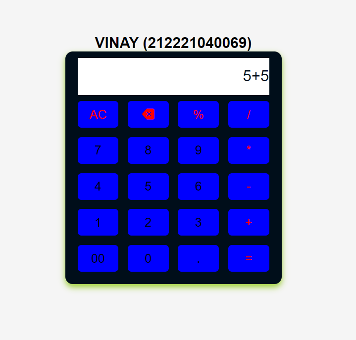
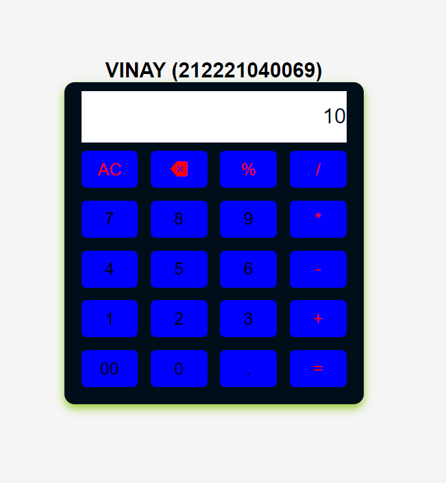

# Standard-Calculator
Aim:Design a Webpage using JavaScript eith a minimum of five mathematical operations.

# output:

# Result:
Thus,Creating a Webpage using JavaScript with a minimum of five mathematical operations was done successfully.

